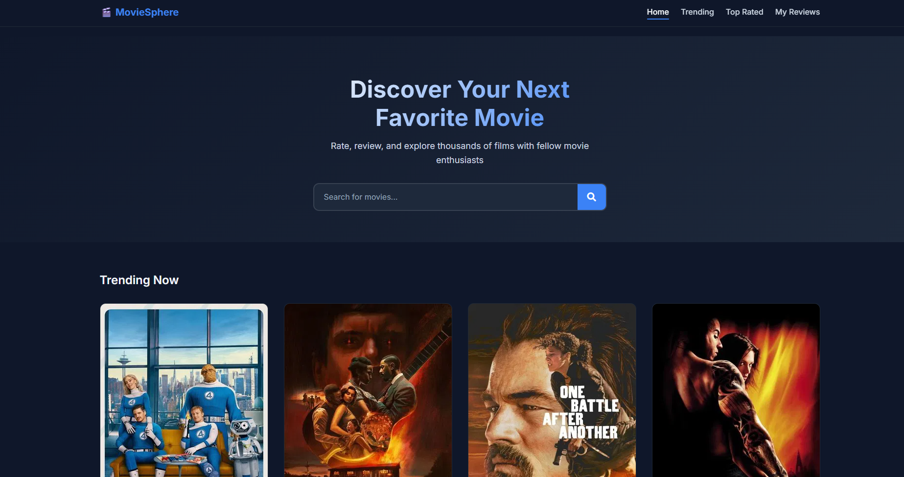
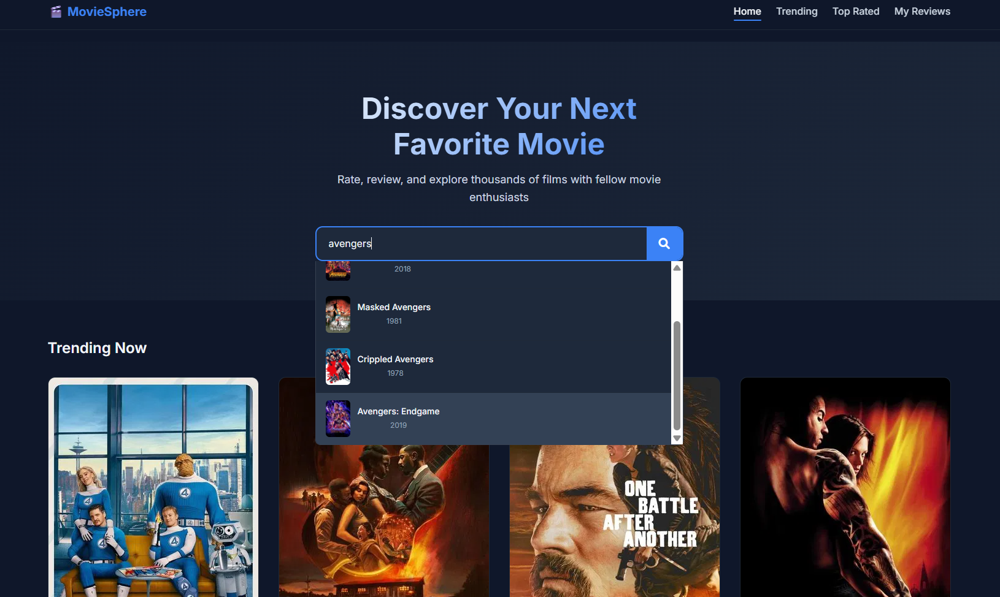
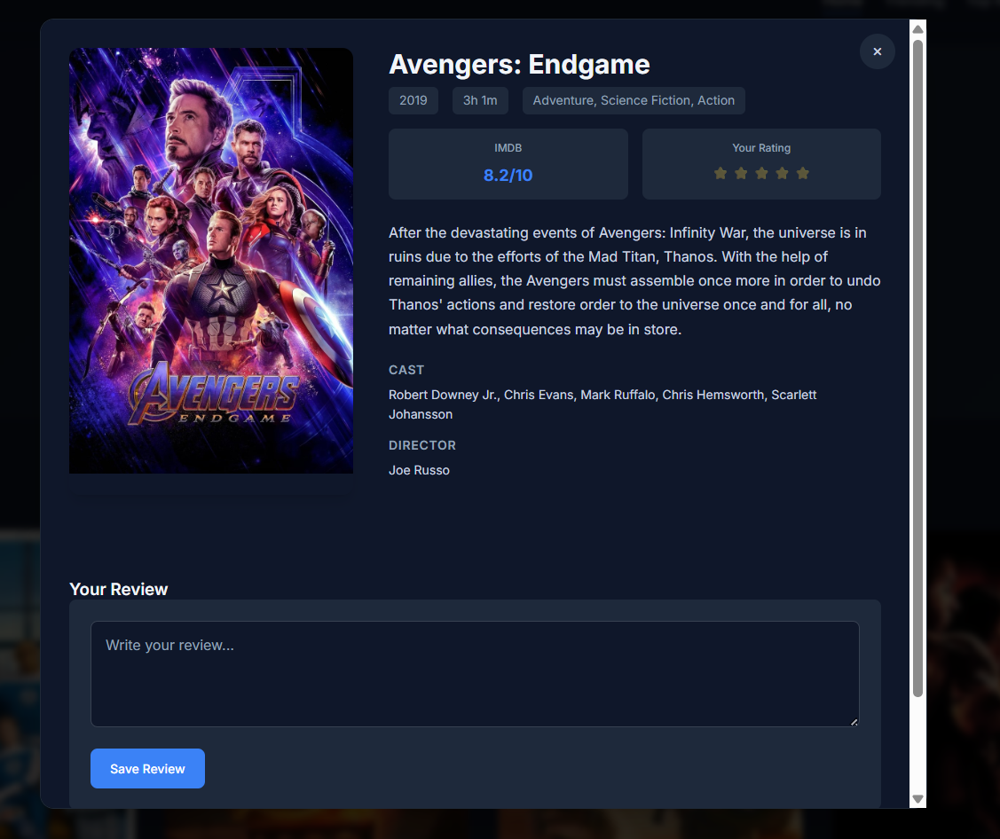
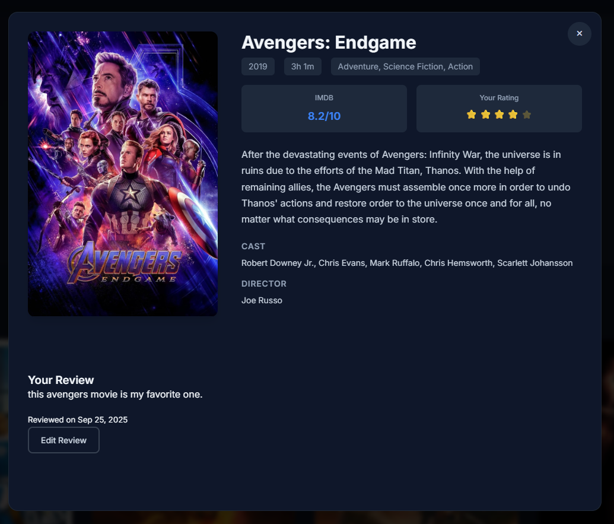
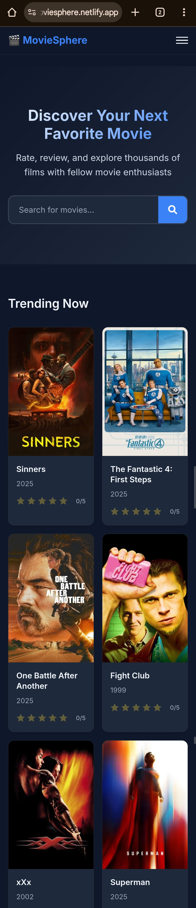

# MovieSphere - Movie Review & Rating Platform

## 🔗 Live Demo
**[� View Live Project](https://jaimoviesphere.netlify.app/)**

## �🎬 Project Overview
A modern, responsive movie review and rating platform built with vanilla HTML, CSS, and JavaScript. Users can discover movies, read details, rate films, and write reviews.

## � Project Screenshots

### 🏠 Home Page - Hero Section

*Clean, modern homepage with search functionality and trending movies*

### 🔍 Movie Search & Discovery

*Real-time search with suggestions and comprehensive movie results*

### 🎭 Movie Details Modal

*Detailed movie information with cast, ratings, and user reviews*

### ⭐ Rating & Review System

*Intuitive star rating system and user review management*

### 📱 Mobile Responsive Design

*Fully responsive design optimized for all device sizes*


## 🚀 Features
- **Movie Discovery**: Search and browse trending/top-rated movies
- **Movie Details**: Comprehensive information including cast, plot, ratings
- **User Reviews**: Write and manage personal movie reviews
- **Rating System**: Rate movies with star ratings
- **Responsive Design**: Mobile-first approach for all devices
- **Local Storage**: Persist user data without backend
- **API Integration**: Real-time movie data from TMDB/OMDB

## 🛠️ Tech Stack
- **Frontend**: HTML5, CSS3, JavaScript (ES6+)
- **APIs**: TMDB API / OMDB API
- **Storage**: Local Storage API
- **Icons**: Font Awesome
- **Fonts**: Google Fonts (Inter)

## 📁 Project Structure
```
MovieSphere/
├── index.html          
├── css/
│   ├── reset.css          
│   ├── variables.css      
│   ├── components.css     
│   ├── layout.css         
│   └── responsive.css
|   └──enhancements.css   
├── js/
│   ├── config.js          
│   ├── api.js             
│   ├── storage.js         
│   ├── utils.js           
│   ├── components.js      
│   └── app.js
    └──env-config.js            
```

## 🔧 Setup Instructions
1. Clone/download the project
2. Get API key from TMDB (https://www.themoviedb.org)
3. Add your API key to `js/config.js`
4. Open `index.html` in a web browser or serve with a local server

## � Deployment

### Live Version
The project is deployed and accessible at: **[https://jaimoviesphere.netlify.app/](https://jaimoviesphere.netlify.app/)**

### Deployment Platforms
This project can be easily deployed to various static hosting platforms:

#### 🟢 Netlify (Current)
- **URL**: https://jaimoviesphere.netlify.app/
- **Build Command**: Not required (static files)
- **Publish Directory**: `/` (root)
- **Environment Variables**: Set `TMDB_API_KEY` in Netlify dashboard

#### 🔵 Vercel
```bash
npx vercel --prod
```

#### 🟠 GitHub Pages
1. Push to GitHub repository
2. Go to Settings > Pages
3. Select source branch (main)
4. Site will be available at: `https://username.github.io/repository-name`

#### ⚫ Netlify CLI Deployment
```bash
npm install -g netlify-cli
netlify deploy --prod --dir .
```

### 🔐 Environment Configuration for Production
For production deployment, ensure your API keys are properly configured:

1. **Never commit real API keys** to the repository
2. Use platform environment variables:
   - Netlify: Site settings > Environment variables
   - Vercel: Project settings > Environment Variables
3. The app will automatically use environment variables if available

### 📋 Pre-deployment Checklist
- [ ] API keys are configured via environment variables
- [ ] All images and assets are optimized
- [ ] Test the application locally with `./serve-local.ps1`
- [ ] Verify responsive design on different devices
- [ ] Check browser console for errors
- [ ] Test API functionality with real data

## �📱 Responsive Breakpoints
- Mobile: 320px - 768px
- Tablet: 768px - 1024px
- Desktop: 1024px+

## 🎯 Development Phases
1. **Planning & Setup** - Project structure and dependencies
2. **HTML Structure** - Semantic markup and accessibility
3. **CSS Styling** - Modern responsive design
4. **JavaScript Core** - API integration and storage
5. **Advanced Features** - Enhanced UX and interactions
6. **Testing & Optimization** - Performance and cross-browser testing

---

## 🤝 Contributing

Contributions are welcome! Here's how you can help improve MovieSphere:

1. **Fork the repository**
2. **Create a feature branch**: `git checkout -b feature/amazing-feature`
3. **Commit your changes**: `git commit -m 'Add amazing feature'`
4. **Push to the branch**: `git push origin feature/amazing-feature`
5. **Open a Pull Request**

### 🐛 Bug Reports
If you find a bug, please create an issue with:
- Clear description of the problem
- Steps to reproduce
- Expected vs actual behavior
- Browser and device information

### 💡 Feature Requests
For new features, please:
- Check existing issues first
- Provide detailed description
- Explain the use case
- Consider implementation complexity

## 📄 License

This project is licensed under the MIT License - see the [LICENSE](LICENSE) file for details.

## 🙏 Acknowledgments

- **[TMDB (The Movie Database)](https://www.themoviedb.org/)** - Movie data and images
- **[OMDB API](http://www.omdbapi.com/)** - Additional movie information
- **[Font Awesome](https://fontawesome.com/)** - Icons
- **[Google Fonts](https://fonts.google.com/)** - Typography (Inter)
- **[Netlify](https://netlify.com/)** - Hosting and deployment

## 📊 Project Status

🟢 **Active Development** - This project is actively maintained and updated.

### Recent Updates
- ✅ Secure API key management
- ✅ Responsive design improvements
- ✅ Enhanced error handling
- ✅ Local development workflow
- 🔄 Working on performance optimizations

### Upcoming Features
- [ ] User authentication
- [ ] Social sharing
- [ ] Advanced filtering
- [ ] Movie recommendations
- [ ] Offline support (PWA)

---

**Made with ❤️ by [Jaichanaditya](https://github.com/jaichanaditya03)**